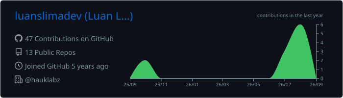
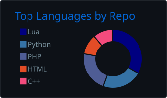
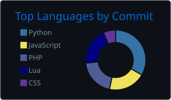

# 👋 Hello, I'm Luan Lima, Software Engineer

#### Backend • Frontend • Desktop 

I'm passionate about building robust and scalable web applications across the full stack. Beyond web development, I'm also enthusiastic about reverse engineering and low-level programming, where I enjoy exploring how systems work under the hood.

**Currently:** Working as a Full Stack Developer

---

  

  

    
    
  

